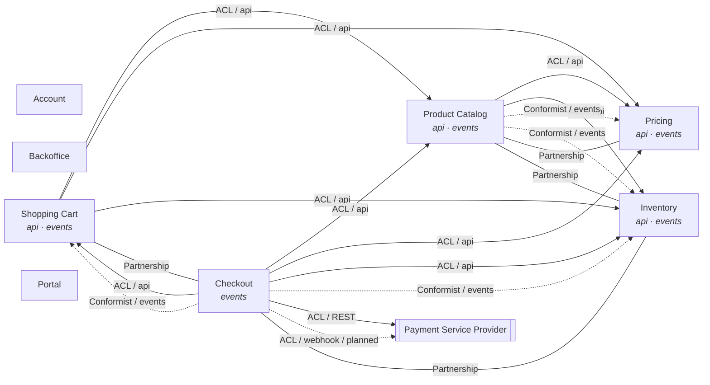

# Context Map

> **Generated file — do not edit.** Derived from the `@BoundedContext`, `@Upstream`,
> `@ExternalUpstream`, and `@Partnership` package annotations by
> `ContextMapRenderer`. After changing a declaration, regenerate and commit this file.

Each side declares only what it controls: the downstream declares its consumed upstreams
(`@Upstream`: translation strategy and channel), the upstream publishes its contract
(`api`/`events` named interfaces, `@OpenHostService`), and partnerships are declared
symmetrically on both contexts. Organizational patterns such as Customer–Supplier are not
machine-classified; Separate Ways is the absence of any declaration. External systems
appear via `@ExternalUpstream` on their consuming context — the model dependency always
points to the external system, regardless of who initiates the exchange. Non-context
modules and the shared kernel are intentionally not part of this map.

## Bounded Contexts

| Module | Name | Description | Published interfaces |
|---|---|---|---|
| account | Account | User account management, authentication, and profile handling | — |
| backoffice | Backoffice | Operating this application: event publication log, dashboards, operator views | — |
| cart | Shopping Cart | Cart management, item additions/removals, and cart lifecycle | api, events |
| checkout | Checkout | Checkout process, order placement, and payment orchestration | events |
| inventory | Inventory | Stock level management and inventory tracking | api, events |
| portal | Portal | Web portal, user interface composition, and cross-context views | — |
| pricing | Pricing | Product pricing management and price change tracking | api, events |
| product | Product Catalog | Product management, catalog browsing, and inventory tracking | api, events |

## Diagram

Arrows point from downstream to upstream (dependency direction, never call direction).
Solid arrows are synchronous consumption (`api` / external `outbound`), dotted arrows are
asynchronous consumption (`events` / external `inbound`), plain lines are partnerships.
Double-framed nodes are external systems. Node badges list published interfaces.
Edges labeled `planned` are declared intent without a code dependency yet.

## Upstream relationships

| Downstream | Upstream | Channel | Translation | Status | Rationale |
|---|---|---|---|---|---|
| cart | product | api | ACL | implemented | Cart works with its own article snapshot; the catalog model must not leak into cart invariants |
| cart | pricing | api | ACL | implemented | Price lookups are translated into the cart's own price representation |
| cart | inventory | api | ACL | implemented | Stock availability is translated into the cart's own article data |
| checkout | product | api | ACL | implemented | Product data is translated into checkout's own article and product info types |
| checkout | pricing | api | ACL | implemented | Prices are translated into checkout's own line item amounts |
| checkout | inventory | api | ACL | implemented | Stock availability is translated into checkout's own article data |
| checkout | inventory | events | Conformist | implemented | CheckoutConfirmedEvent implements inventory's consumer-defined StockReductionTrigger contract as-is |
| checkout | cart | api | ACL | implemented | Cart snapshots are translated into checkout's own CartData |
| checkout | cart | events | Conformist | implemented | CheckoutConfirmedEvent implements cart's consumer-defined CartCompletionTrigger contract as-is; cart change events are consumed directly |
| product | pricing | api | ACL | implemented | Prices are translated into the catalog's own product presentation data |
| product | inventory | api | ACL | implemented | Stock levels are translated into the catalog's own availability data |
| product | pricing | events | Conformist | implemented | ProductCreatedEvent implements pricing's consumer-defined PriceInitializationTrigger contract as-is |
| product | inventory | events | Conformist | implemented | ProductCreatedEvent implements inventory's consumer-defined StockInitializationTrigger contract as-is |

## External systems

| Consumer | External system | Interaction | Protocol | Exchanges | Translation | Status | Rationale |
|---|---|---|---|---|---|---|---|
| checkout | Payment Service Provider | outbound | REST | payment operations (initiate, confirm, refund) | ACL | implemented | Behind the caller-owned PaymentProvider port; the sample ships a mock adapter in place of a real gateway |
| checkout | Payment Service Provider | inbound | webhook | payment confirmation (payment id, status) | ACL | planned | Will trigger order fulfillment; the payload is the provider's contract, to be translated into a local command at the incoming adapter — no webhook adapter exists yet |

## Partnerships

| Contexts | Rationale |
|---|---|
| cart ↔ checkout | Cart owns the consumer-defined CartCompletionTrigger contract that checkout events implement; both contexts evolve it together — Checkout implements cart's consumer-defined CartCompletionTrigger contract; both contexts evolve it together |
| checkout ↔ inventory | Checkout implements inventory's consumer-defined StockReductionTrigger contract; both contexts evolve it together — Inventory owns the consumer-defined StockReductionTrigger contract that checkout events implement; both contexts evolve it together |
| inventory ↔ product | Inventory owns the consumer-defined StockInitializationTrigger contract that the catalog's events implement; both contexts evolve it together — The catalog implements inventory's consumer-defined StockInitializationTrigger contract; both contexts evolve it together |
| pricing ↔ product | Pricing owns the consumer-defined PriceInitializationTrigger contract that the catalog's events implement; both contexts evolve it together — The catalog implements pricing's consumer-defined PriceInitializationTrigger contract; both contexts evolve it together |
