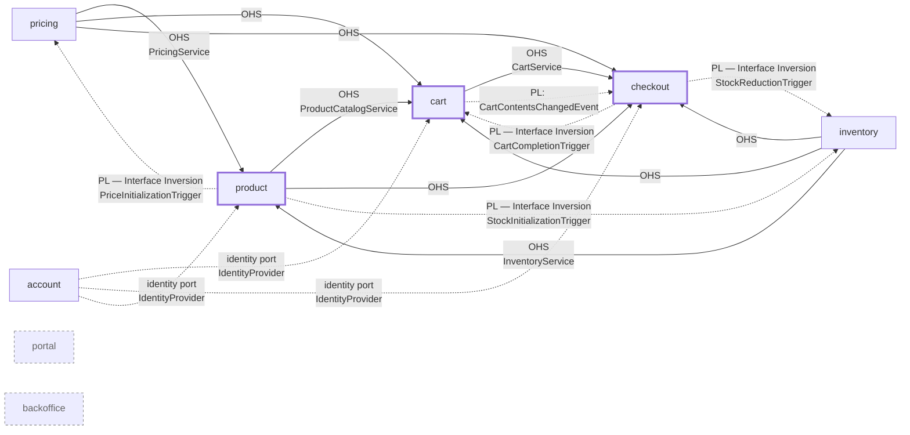

# Context Map

Strategic view of the bounded contexts in this reference implementation and how
they relate: relationship patterns in DDD terms (Customer/Supplier, Published
Language, Interface Inversion, Separate Ways) and the subdomain type of each
context. **Hand-maintained** by the `/context-map` skill.

The structural truth is [`architecture/context-map.md`](architecture/context-map.md):
that file is generated by the architecture test from the `@Upstream`,
`@ExternalUpstream` and `@Partnership` declarations on the `package-info.java`
files and fails the build when it is stale. Where the two differ, the generated
one is right about *which* dependencies exist; this one adds the strategic
reading — pattern names and subdomain types — that no annotation carries.

## Bounded Contexts

| Context | Responsibility | Subdomain |
|---|---|---|
| `product` | Product Catalog: master data, categories, composite-article aggregation | Core |
| `pricing` | Price determination and price-change tracking; OHS for other contexts | Supporting |
| `inventory` | Stock management and stock reduction | Supporting |
| `cart` | Shopping cart for guest and authenticated users | Core |
| `checkout` | Checkout process, payment orchestration, order confirmation | Core |
| `account` | User accounts, authentication, profile management | Supporting |
| `portal` | Storefront UI / cross-context views (aggregated client-side) | Generic (UI) |
| `backoffice` | Operating this application — event publication log, operator views | Generic (Ops) |

The subdomain classification drives pattern choice and ArchUnit rule-set
strictness per context — see
[ADR-025: Pattern Selection per Subdomain Type](architecture/adr/adr-025-pattern-selection-per-subdomain.md).
(In this sample all contexts use the rich domain-model style for didactic
reasons; the ADR documents what a production system would relax.)

Shared Kernel: `sharedkernel/` contains the universal value objects (`ProductId`,
`Money`, `UserId`, …) and the composable specification pattern; the architectural
markers come from `dca-building-blocks`. Deliberately kept small; its one port is
the identity port `IdentityProvider`, which Account implements.

## Relationships

Three axes, and only the first two are in the code. **Declared** is what
`@Upstream(translation, via)` states: how *this* context protects its model —
`ACL` or `Conformist`. **Published by the upstream** is what `@OpenHostService`
and the `api`/`events` packages state. **Organisational** is the team
relationship, which no annotation carries and which therefore lives only here.
A relationship is normally all three at once: the catalog consumes pricing
through an OHS, translates it with an ACL, and the two teams work as
Customer/Supplier — those are three answers, not three competing names.

| Upstream | Downstream | Declared (`translation` / `via`) | Organisational | Realised via |
|---|---|---|---|---|
| `pricing` | `product` | ACL / api | Partnership | `pricing.api.PricingService` → `product/adapter/outgoing/pricing/PricingDataAdapter` |
| `inventory` | `product` | ACL / api | Partnership | `inventory.api.InventoryService` → `product/adapter/outgoing/inventory/InventoryStockDataAdapter` |
| `product` | `cart` | ACL / api | Customer/Supplier | `product.api.ProductCatalogService` → `cart/adapter/outgoing/product/CompositeArticleDataAdapter` |
| `pricing` | `cart` | ACL / api | Customer/Supplier | `pricing.api.PricingService` (via `CompositeArticleDataAdapter`) |
| `inventory` | `cart` | ACL / api | Customer/Supplier | `inventory.api.InventoryService` (via `CompositeArticleDataAdapter`) |
| `product` | `checkout` | ACL / api | Customer/Supplier | `product.api.ProductCatalogService` → `checkout/adapter/outgoing/product/*Adapter` |
| `pricing` | `checkout` | ACL / api | Customer/Supplier | `pricing.api.PricingService` |
| `inventory` | `checkout` | ACL / api | Partnership | `inventory.api.InventoryService` |
| `cart` | `checkout` | ACL / api | Partnership | `cart.api.CartService` (lookups) |
| `cart` | `checkout` | Conformist / events | Partnership | `cart.events.CartContentsChangedEvent` → `checkout/adapter/incoming/event/cartsync/CartChangeEventConsumer` |
| `checkout` | `cart` | Conformist / events | Partnership | `checkout.events.CheckoutConfirmedEvent` *implements* `cart.events.CartCompletionTrigger`; consumer in `cart/adapter/incoming/event/cartcheckout/CartCompletionEventConsumer` |
| `checkout` | `inventory` | Conformist / events | Partnership | `checkout.events.CheckoutConfirmedEvent` *implements* `inventory.events.StockReductionTrigger`; consumer in `inventory/adapter/incoming/event/StockReductionEventConsumer` |
| `product` | `pricing` | Conformist / events | Partnership | `product.events.ProductCreatedEvent` *implements* `pricing.events.PriceInitializationTrigger`; consumer in `pricing/adapter/incoming/event/PriceInitializationEventConsumer` |
| `product` | `inventory` | Conformist / events | Partnership | `product.events.ProductCreatedEvent` *implements* `inventory.events.StockInitializationTrigger`; consumer in `inventory/adapter/incoming/event/StockInitializationEventConsumer` |
| Payment Service Provider | `checkout` | ACL / REST (outbound), ACL / webhook (inbound, **planned**) | Conformist to the provider's contract | `@ExternalUpstream` on the checkout package; behind the caller-owned `PaymentProvider` port, with a mock adapter in place of a real gateway. No webhook adapter exists yet |
| `account` | `cart`, `checkout`, `product` | not declared — the dependency runs through the shared kernel | Supplier of identity | `sharedkernel.application.shared.IdentityProvider` is implemented only in `account/adapter/outgoing/security`; the incoming adapters of Cart, Checkout and Product resolve the caller through that port and hand the customer to their use cases as a command or query field. Invisible to `allowedDependencies`, which is why it is stated here. Account itself depends on no other context |
| `portal` | (all) | not declared | Separate Ways | Aggregation happens client-side; no Java cross-context imports |
| `backoffice` | (all) | not declared | Separate Ways | Consumes only Spring Modulith infrastructure (`JdbcEventPublicationLogStore`) |

Every upstream in the first block publishes through `@OpenHostService` on its
`api` type; the event contracts are the published language of their context.
Partnerships are the pairs that declare `@Partnership` on both sides: `cart` ↔
`checkout`, `checkout` ↔ `inventory`, `inventory` ↔ `product`, `pricing` ↔
`product` — each of them owns a consumer-defined event contract the other
implements, which is why the two evolve it together.

### Pattern notes

- **Open Host Service (upstream) + ACL (downstream):** The upstream context
  exposes a dedicated, narrow API package (`<context>/api/`) carrying
  `@OpenHostService`; Spring Modulith makes it visible to other modules via
  `Type.OPEN`. The downstream consumes it only in its *outgoing-adapter* layer
  and translates the API types into its own domain model — that translation is
  what `translation = ANTI_CORRUPTION_LAYER` declares.
- **Published Language (upstream) + Conformist (downstream):** Integration
  events live in `<context>/events/` and are exposed under
  `<context> :: events`. The consumer takes them as published — declared as
  `translation = CONFORMIST` — with its consumers in `adapter/incoming/event/`.
- **Interface Inversion (a variant of Published Language):** The *consuming*
  context defines the event interface (e.g. `CartCompletionTrigger`); the
  *publishing* context implements that interface on its integration event
  (`CheckoutConfirmedEvent`). This removes any compile-time dependency from the
  consumer to the publisher.
- **Separate Ways:** No direct code or event dependencies.

## Diagram

**Legend:** Solid arrow = synchronous OHS call (REST / service); dotted arrow =
asynchronous integration event (Published Language). Thick-border nodes = core
subdomain; dashed-border nodes = Separate Ways (no compile-time cross-context
dependency).

## Notable design choices

1. **No Conformist relationships.** Each downstream context maps foreign API
   types into its own domain types inside the adapter layer — the domain code
   never sees types from `<other-context>.api`.
2. **No Anti-Corruption Layer (yet).** There is no foreign legacy context that
   would require an ACL. If an external system is integrated later, the
   corresponding outgoing adapter will be promoted to an ACL.
3. **Interface Inversion** is the preferred pattern whenever the publisher sits
   architecturally *below* the consumer — it prevents a backwards dependency
   without introducing a shared schema module.
4. **`backoffice` is a bounded context of a generic subdomain.** Its language is
   its own — an *event publication* is a dispatched domain event with a
   completion status, a concept no business context uses. It reads what others
   have published and negotiates no contract, hence Separate Ways. Context-specific
   admin UIs (product editor, pricing maintenance) belong to their own bounded
   contexts under `/backoffice/{context}/`, not here.
5. **`portal` aggregates at the UI layer**, not in Java code. There is no
   backend aggregation service that joins multiple contexts.

## Maintenance

Run `/dca-core:context-map update` whenever:

- a new bounded context is introduced,
- a new OHS API or integration event is added,
- the `allowedDependencies` entry in a `package-info.java` changes,
- a synchronous/asynchronous switch takes place (e.g. OHS call → event).
